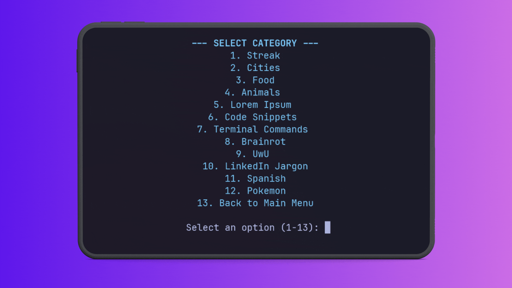

# HyperTyper



A high-octane CLI typing game built with Python. Test your speed, build your streaks, and dominate the leaderboard!

## Features

- **Multiple Game Modes:** Standard, Streak, Cities, Food, Code Snippets, and more!
- **Combo System:** Build up your combo to earn multipliers and reach "God Mode".
- **Sound Effects:** Satisfying audio feedback for every keystroke and milestone (requires `pygame`).
- **High Scores:** Local leaderboard to track your personal bests.
- **Customizable:** Settings for sound, timer length, and more.

## Installation

### Prerequisites

- Python 3.6+

### Option 1: Arch Linux (AUR) - Recommended

If you are on Arch Linux, you can install HyperTyper directly from the AUR:

```bash
yay -S hypertyper
```

### Option 2: Using pip (Other Systems)

1.  Clone the repository:
    ```bash
    git clone https://github.com/SyreeseOfficial/HyperTyper.git
    cd HyperTyper
    ```
2.  Install dependencies:
    ```bash
    pip install -r requirements.txt
    ```

## Usage

To start the game, run:

```bash
python3 hypertyper.py
```

Navigate the menus using the number keys and type the words as they appear on the screen!

## Roadmap

- [ ] More game modes
- [ ] More settings
- [ ] Color themes
- [ ] Local multiplayer
